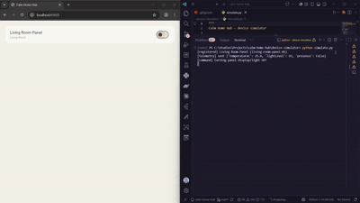

# Calm Home Hub

 

A small, working smart-home control system inspired by mui Lab's **mui Board**
concept: a wooden interface that stays invisible until touched, syncing state
to the cloud and controllable from a mobile app.

This is a portfolio project built to demonstrate hands-on familiarity with
the stack behind a product like mui Board — not an official mui Lab
project.

## Architecture

```
┌────────────────────┐        HTTP        ┌──────────────────────┐        HTTP        ┌────────────────────┐
│  Device Simulator   │ ───── telemetry ──▶│   Backend API         │◀──── device list ── │   Mobile App        │
│  (Python)           │◀──── commands ──── │   (Node.js + TS,      │ ──── commands ────▶ │   (Flutter)         │
│  mimics an IoT panel│                     │   AWS-deployable)     │                     │   calm, idle-by-     │
│                      │                     │                       │                     │   default UI         │
└────────────────────┘                     └──────────────────────┘                     └────────────────────┘
```

| Layer               | Tech                          | Matches internship skill |
|---------------------|--------------------------------|---------------------------|
| Device simulator    | Python                         | Python                    |
| Backend API         | Node.js, TypeScript            | Node.js, TypeScript       |
| Cloud deployment     | AWS Lambda, API Gateway, DynamoDB (see `backend/serverless.yml`) | AWS |
| Mobile app          | Flutter                        | Flutter                   |
| Native extension point | Swift/Kotlin platform channel (not yet implemented — see below) | Swift, Kotlin |

## Running it locally

**1. Backend**
```bash
cd backend
npm install
npm run dev
# → http://localhost:4000
```

**2. Device simulator**
```bash
cd device-simulator
pip install -r requirements.txt
python simulate.py
```

**3. Mobile app**
```bash
cd mobile_app
flutter pub get
flutter run
```

Open the app, and the simulated device should appear within a few seconds
(the simulator registers itself and starts sending telemetry). Toggling the
switch in the app queues a command the simulator will print on its next poll.

## Roadmap / what to build next

- [ ] Add a Swift (iOS) or Kotlin (Android) platform channel — e.g. a
      home-screen widget showing device status — to demonstrate native
      mobile beyond Flutter.
- [ ] Swap the in-memory `DeviceStore` for DynamoDB and deploy via
      `serverless.yml` to get this running on real AWS infrastructure.
- [ ] Replace HTTP polling with MQTT (AWS IoT Core) for lower-latency,
      more realistic IoT device communication.
- [ ] Add simple automation rules (e.g. time-based scenes).
- [ ] See `docs/INDIA_MARKET_NOTES.md` for product-adaptation ideas relevant
      to mui Lab's stated interest in the Indian market.

## Why this project

Built as a portfolio piece for an SDE-track application to mui Lab's
Software Engineer Intern role (mui Board development). The goal was a
project that's thematically close to mui Board itself — a "calm," mostly
invisible device synced to the cloud — rather than a generic CRUD app,
while covering the internship's required skills (Python, TypeScript,
Node.js, AWS, Flutter, Swift, Kotlin).
